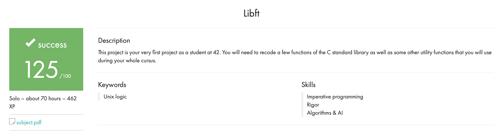

## libft

This library is a collection of custom C functions that we will be using throughout the rest of our time at 42. The functions contained in this library will be used in many of the projects that we will be working on.

### How to use

1. Clone this repository to your local machine.
2. Compile the library by running `make` in the root directory of the repository.
3. Include the header file `libft.h` in your project.
4. Link the library by passing the flag `L/path/to/libft -lft` to your compiler.

### Contents

The library contains functions for working with strings, memory, and linked lists. The full list of functions can be found in the `libft.h` header file.

## Authors

libft was created by Hyunah JUNG. If you have any questions or feedback, please feel free to contact me.

## Acknowledgements

We would like to thank 42 school for providing us with the opportunity to work on this project and learn new skills.
